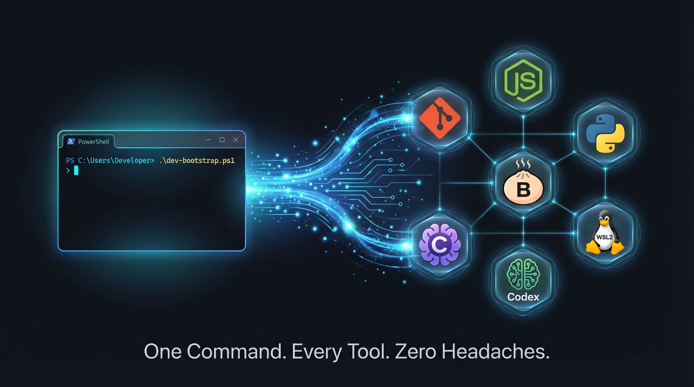
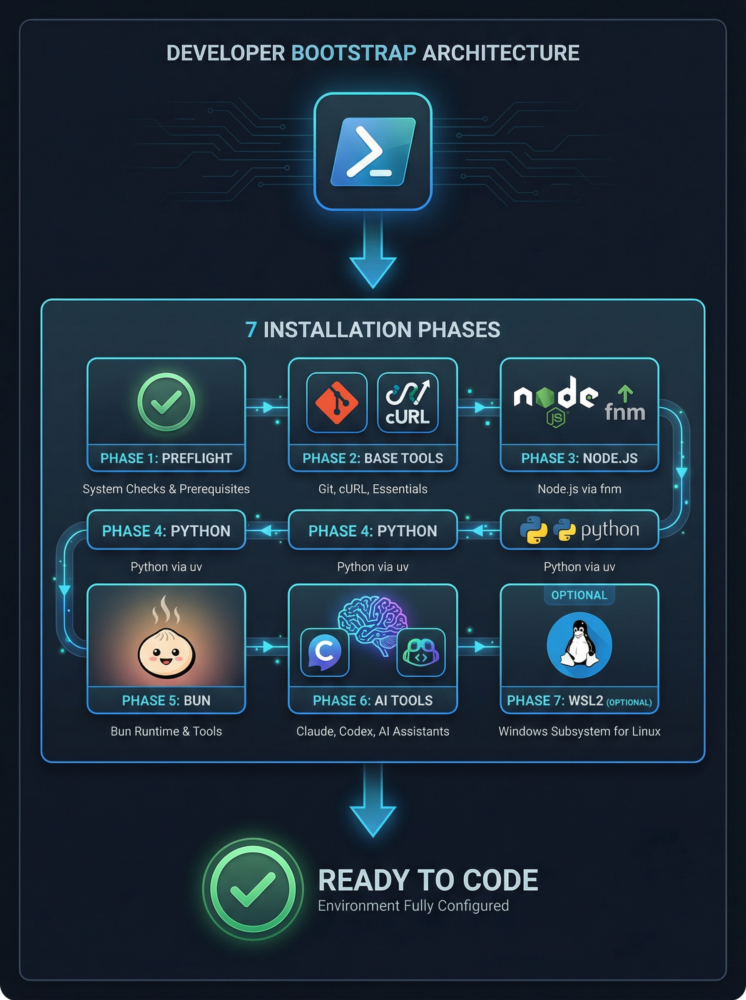

<p align="center">
  
</p>

<h1 align="center">dev-bootstrap</h1>

<p align="center">
  <strong>The one-command Windows dev environment that nobody built — until now.</strong>
</p>

<p align="center">
  <a href="https://opensource.org/licenses/MIT"></a>
  <a href="#"></a>
  <a href="#"></a>
  <a href="#"></a>
  <a href="https://github.com/AojdevStudio/dev-bootstrap/stargazers"></a>
</p>

<p align="center">
  Git &bull; Node.js &bull; Python &bull; Bun &bull; Claude Code &bull; Codex CLI &bull; WSL2 &bull; Docker Desktop<br>
  <em>One command. All of them. On Windows.</em>
</p>

---

## The Problem

You just got a new Windows laptop. You want to build something.

You Google "how to set up Node.js on Windows." Seven tabs open. Then Python. Then Git. Then you need a proper terminal. Then someone mentions WSL. Then you realize you need Bun for that new framework. Then Claude Code because everyone's using AI now. Then Codex CLI because why not both.

**Four hours later, you're still installing things.**

Every tool has its own installer. Its own docs. Its own "getting started" page. They all assume you already have the other ones. None of them talk to each other. And if you're a designer, a student, or someone who just wants to try building something — you're stuck before you even start.

> *"I spent this morning with my designer installing Homebrew — it just wasn't on her laptop. It's a nightmare."*
>
> — **Claire Vo**, host of [How I AI](https://www.youtube.com/watch?v=Yb9IyTOh0xg&t=511s), describing the developer setup experience for non-engineers

<details>
<summary><strong>Watch the moment that started this project</strong></summary>

<br>

https://github.com/user-attachments/assets/f310b640-4eae-40da-81cb-0cdeffa8770d

> From the [How I AI podcast](https://www.lennysnewsletter.com/p/this-week-on-how-i-ai-automate-the) featuring Vercel CEO Guillermo Rauch. Claire Vo describes exactly the problem: even experienced tech professionals struggle to get a basic development environment running. Guillermo's response? *"It's nightmare fuel."*
>
> **[Watch the full episode on YouTube](https://www.youtube.com/watch?v=Yb9IyTOh0xg&t=511s)**

That's when we asked the question nobody had asked before.

</details>

## The Question

After watching that interview, we went to [Perplexity AI](https://perplexity.ai) and asked:

> *"Has anyone ever created a shell script that gets a Windows laptop prepared for a development environment end-to-end — Python, Node, Bun, Claude Code, Codex CLI, and more — all installable through one command?"*

Perplexity reviewed **15 sources** and came back with this:

> *"You're bumping into the reality that lots of people have partial setup scripts, but almost nobody has a single polished one-command Windows-native dev machine bootstrapper that covers the entire stack end-to-end in a reusable way."*
>
> *"What exists today: most ecosystems provide their own installer or tiny bootstrap script, but they're all siloed. Python tooling, Node managers, Bun, Claude Code, Codex — they all have their own. Everyone is publishing 'how to install on Windows' docs, but almost no one is publishing 'here's a cohesive script that installs everything, configures paths, terminals, WSL, and dotfiles — all in one shot.'"*

So we built it.

## The Solution

### Windows

```powershell
Set-ExecutionPolicy -Scope Process -ExecutionPolicy Bypass -Force; irm https://raw.githubusercontent.com/AojdevStudio/dev-bootstrap/main/bootstrap.ps1 | iex
```

> **Why the `Set-ExecutionPolicy` prefix?** On many managed, school, church, and enterprise Windows machines, the default `Restricted` policy blocks `iex`. The `-Scope Process` bypass only applies to the current terminal session — it does **not** change system-wide policy.

### macOS

```bash
curl -fsSL https://raw.githubusercontent.com/AojdevStudio/dev-bootstrap/main/macos/bootstrap.sh | bash
```

macOS extras included:
- **lazygit** (git TUI)
- **yazi** (terminal file manager) — installed via Homebrew per https://yazi-rs.github.io/docs/installation/#homebrew

One command. Paste it in your terminal. Walk away. Come back to a configured development machine.

<p align="center">
  
</p>

## What Gets Installed

| Tool | Version | Purpose | Source |
|------|---------|---------|--------|
| **Git** | Latest | Version control | [git-scm.com](https://git-scm.com/download/win) via winget |
| **cURL** | Latest | HTTP transfers | [winget](https://learn.microsoft.com/en-us/windows/package-manager/winget/) |
| **GitHub CLI** | Latest | `gh` — GitHub from the terminal | [cli.github.com](https://cli.github.com/) via winget |
| **Windows Terminal** | Latest | Modern terminal with tabs, Unicode, GPU rendering | [Microsoft.WindowsTerminal](https://github.com/microsoft/terminal) via winget |
| **fnm** | Latest | Node version manager | [github.com/Schniz/fnm](https://github.com/Schniz/fnm) via winget |
| **Node.js** | LTS | JavaScript runtime | Installed via fnm |
| **npm** | Bundled | Package manager | Comes with Node.js |
| **pnpm** | Latest | Fast, disk-efficient package manager | Activated via [Corepack](https://nodejs.org/api/corepack.html) (bundled with Node ≥16.10) |
| **uv** | Latest | Python toolchain | [astral-sh.uv](https://docs.astral.sh/uv/) via winget |
| **Python** | 3.12 (pinned) | Python runtime | Installed via uv |
| **Bun** | Latest | Fast JS runtime | [Oven-sh.Bun](https://bun.sh) via winget |
| **ripgrep** | Latest | Fast `grep` replacement | [BurntSushi.ripgrep.MSVC](https://github.com/BurntSushi/ripgrep) via winget |
| **fd** | Latest | Fast `find` replacement | [sharkdp.fd](https://github.com/sharkdp/fd) via winget |
| **bat** | Latest | `cat` with syntax highlighting | [sharkdp.bat](https://github.com/sharkdp/bat) via winget |
| **jq** | Latest | JSON processor | [jqlang.jq](https://jqlang.github.io/jq/) via winget |
| **fzf** | Latest | Command-line fuzzy finder | [junegunn.fzf](https://github.com/junegunn/fzf) via winget |
| **lazygit** | Latest | TUI for git | [JesseDuffield.lazygit](https://github.com/jesseduffield/lazygit) via winget |
| **yazi** | Latest | TUI file manager | [sxyazi.yazi](https://yazi-rs.github.io/) via winget |
| **PowerToys** | Latest | Windows power-user utility bundle | [Microsoft.PowerToys](https://github.com/microsoft/PowerToys) via winget |
| **Claude Code** | Latest + auto-updating | Anthropic AI CLI | [Anthropic native installer](https://code.claude.com/docs/en/setup) (`install.ps1`; npm install is deprecated upstream) |
| **Codex CLI** | Latest | OpenAI code assistant | [@openai/codex@latest](https://developers.openai.com/codex/cli) via npm |
| **WSL2** | Latest | Linux on Windows | [Microsoft](https://learn.microsoft.com/en-us/windows/wsl/install) *(optional; installs Chromium inside WSL via apt)* |
| **Docker Desktop** | Latest | Container runtime + desktop app | [Docker.DockerDesktop](https://docs.docker.com/desktop/setup/install/windows-install/) via winget *(skipped with `-SkipWSL`)* |

> Every tool is installed from its **official canonical source**. Most tools use winget, Corepack, uv, or npm; Claude Code intentionally uses Anthropic's native installer so it can receive background auto-updates. No third-party mirrors. No mystery binaries. All sources are documented inline in `bootstrap.ps1`.

## How It Works

The installer runs through **8 phases**, each building on the last:

| Phase | What Happens |
|-------|-------------|
| **1. Preflight** | Verifies winget is available. Auto-elevates to admin if WSL is needed. |
| **2. Base Tools** | Installs Git and cURL via winget. |
| **3. Node.js** | Installs fnm (Fast Node Manager), then Node LTS + npm. Adds fnm hook to your PowerShell profile. |
| **4. Python** | Installs uv (Astral's Python toolchain), then Python 3.12 pinned. |
| **5. Bun** | Installs the Bun JavaScript runtime. |
| **6. AI Tools** | Installs Claude Code (Anthropic) and Codex CLI (OpenAI). |
| **7. WSL2** | *(Optional)* Installs Windows Subsystem for Linux v2 + Ubuntu. Runs `wsl/setup.sh` inside WSL for Claude Code + Linux essentials. |
| **8. Docker Desktop** | Installs Docker Desktop via winget after WSL is available. Skipped when `-SkipWSL` is used, with manual setup directions printed at the end. |

### What makes it different

- **Idempotent** — Run it twice, nothing breaks. Profile snippets use markers to avoid duplication.
- **Auto-admin** — If WSL needs admin rights, the script re-launches itself elevated. You don't have to remember "Run as Administrator."
- **PATH-aware** — Refreshes PATH from the Windows registry after each install so subsequent tools can find their dependencies.
- **Fail-fast** — Uses `Set-StrictMode -Version Latest` and `$ErrorActionPreference = "Stop"`. If something fails, you know immediately.
- **WSL-optional** — Pass `-SkipWSL` if you don't need Linux or Docker Desktop. The script prints manual Docker setup directions instead.

## Quick Start

### Requirements

- **Windows 10/11** with [winget](https://learn.microsoft.com/en-us/windows/package-manager/winget/) installed (comes pre-installed on Windows 11)
- **PowerShell 5.0+** (pre-installed on Windows 10/11)
- **Virtualization enabled** if you want WSL2 + Docker Desktop. Docker Desktop also requires supported Windows 10/11 editions and may require license acceptance on first launch.

### Install Everything

```powershell
Set-ExecutionPolicy -Scope Process -ExecutionPolicy Bypass -Force; irm https://raw.githubusercontent.com/AojdevStudio/dev-bootstrap/main/bootstrap.ps1 | iex
```

If you want the installed fnm profile snippet to load automatically in every future PowerShell session (so `claude`, `codex`, `npm`, etc. stay on PATH after reboot), also run once:

```powershell
Set-ExecutionPolicy -Scope CurrentUser -ExecutionPolicy RemoteSigned
```

> **Managed machines:** If you see *"the setting is overridden by a policy defined at a more specific scope"*, your organization enforces a stricter policy via Group Policy. In that case, you'll need to invoke the `fnm env ... | Invoke-Expression` snippet manually at the start of each shell session, or ask your admin to allow `RemoteSigned` for your account.

### Install Without WSL or Docker Desktop

```powershell
pwsh -File ./bootstrap.ps1 -SkipWSL
```

`-SkipWSL` also skips Docker Desktop because Docker Desktop depends on WSL2 for the default Linux-container backend. The script prints easy manual Docker setup steps at the end.

### After Installation

Open a **new PowerShell window** (required for PATH changes to take effect), then verify:

```powershell
node --version           # Node.js
npm --version            # npm
uv run python --version  # Python 3.12 via uv-managed interpreter
bun --version            # Bun
claude --version         # Claude Code (authenticate: https://code.claude.com/docs/en/setup)
codex --version          # Codex CLI (authenticate: https://developers.openai.com/codex/cli)
docker --version         # Docker CLI, after Docker Desktop starts
```

> **Why `uv run python` instead of `python`?** On Windows, the Microsoft Store `python.exe` alias in `WindowsApps` can shadow your real interpreter. `uv run python` bypasses that alias entirely by asking uv to resolve its managed Python directly. If you need bare `python` on your PATH permanently, run `uv python update-shell` after installation.

## The Story

This project started with a [podcast clip](https://www.youtube.com/watch?v=Yb9IyTOh0xg&t=511s).

Claire Vo was interviewing Vercel CEO Guillermo Rauch on the [How I AI](https://www.lennysnewsletter.com/p/this-week-on-how-i-ai-automate-the) podcast. She paused mid-conversation to highlight something Guillermo had glossed over: **the sheer difficulty of setting up a local development environment for non-engineers.**

She described spending her morning helping her designer install Homebrew — a single tool, on a single laptop — and calling it a nightmare. Guillermo agreed: *"It's nightmare fuel."*

That moment made us ask: **Why hasn't anyone solved this for Windows?** Not partially. Not one tool at a time. The whole thing. One command.

We searched. We asked AI. We checked GitHub. The answer was consistent: **partial solutions exist everywhere, but nobody had stitched them together into a single, cohesive, Windows-native experience.**

So we did.

`dev-bootstrap` isn't a framework. It's not a platform. It's a single PowerShell script that does what should have existed years ago: gets you from a fresh Windows laptop to a fully configured development machine with one command.

Because everyone deserves to skip the nightmare and start building.

## FAQ

<details>
<summary><strong>Is this safe to run?</strong></summary>

Yes. Every tool is installed from its **official source** (Microsoft, Astral, Anthropic, OpenAI, etc.). No third-party mirrors. All source URLs are documented inline in `bootstrap.ps1` — read it yourself before running.

</details>

<details>
<summary><strong>What if I already have some of these tools?</strong></summary>

The script handles this gracefully. winget skips already-installed packages. Profile snippets use markers to avoid duplication. Running it again won't break anything.

</details>

<details>
<summary><strong>Do I need admin rights?</strong></summary>

Only if you want WSL2 or Docker Desktop. The script auto-detects and re-launches as admin if needed. Use `-SkipWSL` to avoid the WSL/Docker path entirely.

</details>

<details>
<summary><strong>Why fnm instead of nvm?</strong></summary>

[fnm](https://github.com/Schniz/fnm) is significantly faster than nvm-windows, has first-class PowerShell support, and is available via winget. It also supports automatic Node version switching via `.node-version` files.

</details>

<details>
<summary><strong>Why uv instead of pyenv?</strong></summary>

[uv](https://docs.astral.sh/uv/) is Astral's next-generation Python toolchain. It manages Python installations, virtual environments, and packages — all in one tool. It's faster than pip and simpler than managing pyenv + pip + virtualenv separately.

</details>

<details>
<summary><strong>Can I customize which tools get installed?</strong></summary>

Not yet — the script installs the full stack. We're considering modular installation flags for a future version. For now, use `-SkipWSL` to skip WSL2 and Docker Desktop.

</details>

## Contributing

Contributions are welcome. Please read [AGENTS.md](AGENTS.md) for project conventions.

Key guidelines:
- `bootstrap.ps1` is the **only user-facing entrypoint**
- All install sources must be **official and canonical**
- Run `./scripts/check-structure.ps1` before submitting changes
- PowerShell: 2-space indent, PascalCase functions
- Bash: `set -euo pipefail`, `#!/usr/bin/env bash`

## License

[MIT](LICENSE) - Copyright 2026 [AOJDevStudio](https://github.com/AojdevStudio)

---

<p align="center">
  <strong>If this saved you from a setup nightmare, <a href="https://github.com/AojdevStudio/dev-bootstrap">give it a star</a>.</strong><br>
  <em>Because nobody should spend their morning installing Homebrew.</em>
</p>

<p align="center">
  <a href="https://github.com/AojdevStudio/dev-bootstrap/stargazers"></a>
</p>
